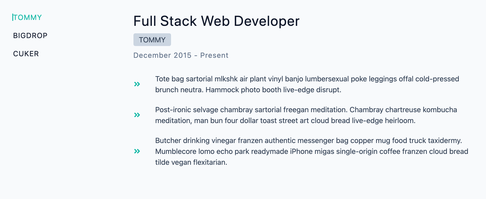

## TabMaster App

This project is focused on creating a dynamic tab-based interface using React. It involves fetching job information from an external API and displaying it in a user-friendly manner. The project allows users to navigate through different tabs with job details and view associated duties. It provides an intuitive interface that showcases job information effectively.

